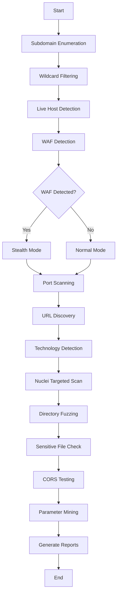

# Fuysaal

<div align="center">


**Advanced Bug Bounty Reconnaissance Tool**

A comprehensive automated reconnaissance framework for bug bounty hunters with WAF detection and adaptive scanning.

[Features](#features) • [Installation](#installation) • [Usage](#usage) • [Tools Required](#required-tools) • [Output](#output)

</div>

---

## Features

### 🎯 Core Capabilities
- **Automated Subdomain Enumeration** - Multi-source enumeration with deduplication
- **Smart WAF Detection** - Auto-adjusts scan speed based on WAF presence
- **Technology Fingerprinting** - Identifies tech stack for targeted scanning
- **Nuclei Integration** - Template mapping based on detected technologies
- **Comprehensive Reporting** - HTML and JSON reports with visual dashboards

### 🔐 Security Modules
- ✅ Subdomain takeover detection
- ✅ Port scanning with naabu
- ✅ Directory fuzzing (adaptive depth)
- ✅ JavaScript secret extraction
- ✅ CORS misconfiguration testing
- ✅ Sensitive file discovery
- ✅ Cloud bucket enumeration (AWS S3, GCS)
- ✅ Parameter mining

### 🚀 Advanced Features
- **Adaptive Scanning** - Automatically adjusts speed based on WAF detection
- **Proxy Support** - Route traffic through proxy lists
- **User-Agent Rotation** - Randomized user agents for stealth
- **Wildcard DNS Filtering** - Removes false positives
- **Scope Management** - Keeps only in-scope results
- **Parallel Execution** - Multi-threaded for performance

---

## Installation

### Prerequisites
- Python 3.8+
- Linux/Unix environment (Kali, Ubuntu, WSL)
- Required tools installed (see [Required Tools](#required-tools))

### Quick Install

```bash
# Clone the repository
git clone https://github.com/yourusername/fuysaal.git
cd fuysaal

# Install Python dependencies
pip3 install -r requirements.txt

# Make executable
chmod +x fuysaal.py

# Run
./fuysaal.py
```

### Docker (Coming Soon)
```bash
docker pull fuysaal/fuysaal:latest
docker run -it fuysaal/fuysaal
```

---

## Required Tools

Fuysaal integrates with popular reconnaissance tools. Install these before running:

### Subdomain Enumeration
```bash
go install -v github.com/projectdiscovery/subfinder/v2/cmd/subfinder@latest
go install -v github.com/tomnomnom/assetfinder@latest
```

### HTTP Probing & Analysis
```bash
go install -v github.com/projectdiscovery/httpx/cmd/httpx@latest
go install -v github.com/projectdiscovery/katana/cmd/katana@latest
go install -v github.com/hakluke/hakrawler@latest
```

### Vulnerability Scanning
```bash
go install -v github.com/projectdiscovery/nuclei/v3/cmd/nuclei@latest
```

### Port Scanning
```bash
go install -v github.com/projectdiscovery/naabu/v2/cmd/naabu@latest
```

### Directory Fuzzing
```bash
# Feroxbuster
wget https://github.com/epi052/feroxbuster/releases/latest/download/feroxbuster_amd64.deb
sudo dpkg -i feroxbuster_amd64.deb
```

### Other Tools
```bash
# WAF Detection
pip3 install wafw00f

# URL Discovery
go install github.com/lc/gau/v2/cmd/gau@latest
go install github.com/tomnomnom/waybackurls@latest

# JavaScript Analysis
go install github.com/003random/getJS@latest
git clone https://github.com/m4ll0k/SecretFinder.git ~/pentest/SecretFinder
git clone https://github.com/GerbenJavado/LinkFinder.git ~/pentest/LinkFinder

# Parameter Discovery
go install github.com/devanshbatham/ParamSpider@latest

# DNS Tools
go install github.com/d3mondev/puredns/v2@latest
apt install dnsutils

# Takeover Detection
go install github.com/pwnesia/dnstake@latest

# Helper Tools
go install github.com/tomnomnom/anew@latest
```

### Wordlists
```bash
sudo apt install seclists
# Or download manually:
# https://github.com/danielmiessler/SecLists
```

---

## Usage

### Basic Scan
```bash
./fuysaal.py
```

You'll be prompted for:
1. **Target** - Single domain or path to target list
2. **Proxy** - Optional proxy list path (or press Enter to skip)

### Example: Single Target
```bash
./fuysaal.py
Target Domain or List Path: example.com
Proxy list path (Enter to skip): [Enter]
```

### Example: Multiple Targets
```bash
# Create targets.txt
echo "example.com" > targets.txt
echo "test.com" >> targets.txt

./fuysaal.py
Target Domain or List Path: targets.txt
Proxy list path (Enter to skip): [Enter]
```

### Example: With Proxy
```bash
./fuysaal.py
Target Domain or List Path: example.com
Proxy list path (Enter to skip): proxies.txt
```

### Proxy List Format
```text
http://proxy1:8080
http://proxy2:8080
socks5://proxy3:1080
```

---

## Output

### Directory Structure
```
scan_YYYYMMDD_HHMMSS/
├── subs.txt                    # All discovered subdomains
├── live.txt                    # Live hosts with status codes
├── naabu.txt                   # Open ports
├── nuclei.txt                  # Vulnerability findings
├── ferox.txt                   # Directory fuzzing results
├── all_urls.txt                # All discovered URLs
├── js.txt                      # JavaScript files
├── secretfinder.txt            # Extracted secrets
├── linkfinder.txt              # Extracted endpoints
├── params_names.txt            # Unique parameters
├── cors.txt                    # CORS misconfigurations
├── sensitive.txt               # Sensitive files found
├── cloud_buckets.txt           # Cloud storage findings
├── waf_detected.txt            # Hosts with WAF
├── subdomaintakeover.txt       # Potential takeovers
├── tech_map.txt                # Technology fingerprints
├── report.json                 # Full JSON report
├── report.html                 # Visual HTML report
└── scan.log                    # Detailed execution log
```

### HTML Report
Open `report.html` in your browser for:
- Visual dashboard with color-coded results
- Categorized findings
- WAF detection status
- Summary statistics
- Clickable links

### JSON Report
`report.json` contains:
- All scan results in structured format
- WAF detection details
- Summary statistics
- Perfect for automation and parsing

---

## Workflow



---

## Configuration

### WAF Detection Modes

#### Stealth Mode (WAF Detected)
```
Rate Limit: 2 req/s
Threads: 5
Delay: 2s
Best for: Protected targets
```

#### Normal Mode (No WAF)
```
Rate Limit: 50 req/s
Threads: 30
Delay: 0s
Best for: Standard targets
```

### Customization
Edit `fuysaal.py` to customize:
- Rate limits in `ScanConfig` class
- Template mappings in `TECH_TEMPLATE_MAP`
- Sensitive file patterns
- Cloud bucket variations

---

## Examples

### Bug Bounty Program
```bash
# Create scope list
cat > targets.txt << EOF
example.com
*.example.com
api.example.com
EOF

./fuysaal.py
# Enter: targets.txt
# Review: report.html for findings
```

### Pentest
```bash
# Single target, fast scan
./fuysaal.py
# Enter: target.com
# Check: nuclei.txt for vulns
```

### Automated Pipeline
```bash
#!/bin/bash
for domain in $(cat domains.txt); do
    echo "[+] Scanning: $domain"
    ./fuysaal.py <<< "$domain"$'\n'
done
```

---

## Tips & Best Practices

### 🎯 For Best Results
1. **Use VPS** - Better bandwidth and IP reputation
2. **Proxy List** - Avoid rate limiting on large scans
3. **Run Overnight** - Comprehensive scans take time
4. **Review Logs** - Check `scan.log` for errors
5. **Update Tools** - Keep recon tools up to date

### ⚠️ Important Notes
- **Always get permission** before scanning targets
- **Respect rate limits** - Don't DDoS targets
- **Review scope** - Only scan authorized domains
- **Check robots.txt** - Respect website policies
- **Use responsibly** - This is for authorized testing only

---

## Troubleshooting

### Tool Not Found
```bash
# Verify tool installation
which subfinder httpx nuclei

# Add Go bin to PATH
echo 'export PATH=$PATH:~/go/bin' >> ~/.bashrc
source ~/.bashrc
```

### Permission Denied
```bash
chmod +x fuysaal.py
```

### Python Dependencies
```bash
pip3 install -r requirements.txt --upgrade
```

### Slow Scans
- Check if WAF was detected (auto-enables stealth mode)
- Verify network connection
- Use proxy list to distribute load

---

## Contributing

Contributions are welcome! Please:

1. Fork the repository
2. Create feature branch (`git checkout -b feature/AmazingFeature`)
3. Commit changes (`git commit -m 'Add AmazingFeature'`)
4. Push to branch (`git push origin feature/AmazingFeature`)
5. Open Pull Request

---

## Roadmap

- [ ] Go version for standalone binary
- [ ] Docker container
- [ ] CI/CD integration
- [ ] Custom template support
- [ ] Database backend for historical data
- [ ] Web dashboard
- [ ] API mode

---

## License

This project is licensed under the MIT License - see the [LICENSE](LICENSE) file for details.

---

## Disclaimer

This tool is for **authorized security testing only**. The authors are not responsible for misuse or damage caused by this tool. Always get proper authorization before testing any systems you don't own.

---

## Author

**Fuysaal**

- Twitter: [@fuysaal](https://twitter.com/fuysaal)
- GitHub: [@fuysaal](https://github.com/fuysaal)

---

## Acknowledgments

- ProjectDiscovery team for amazing tools
- Bug bounty community
- All contributors

---

<div align="center">

**Made with ❤️ for the bug bounty community**

If you find this tool useful, please ⭐ star the repository!

</div>
